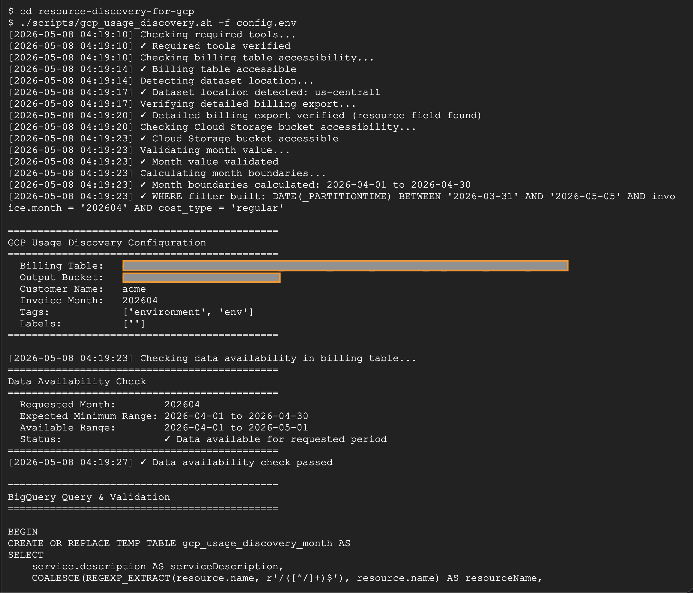
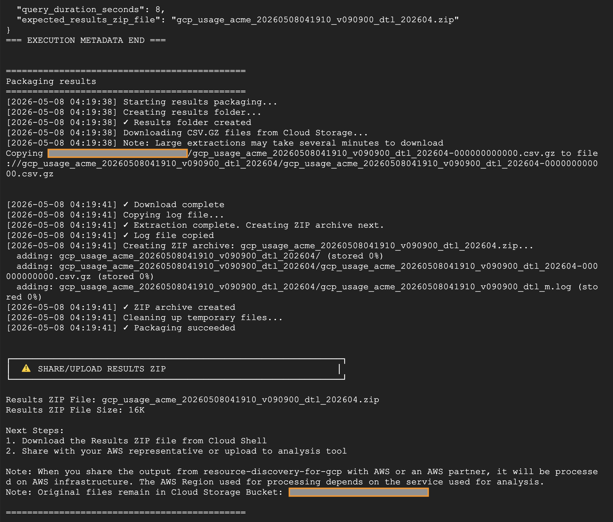
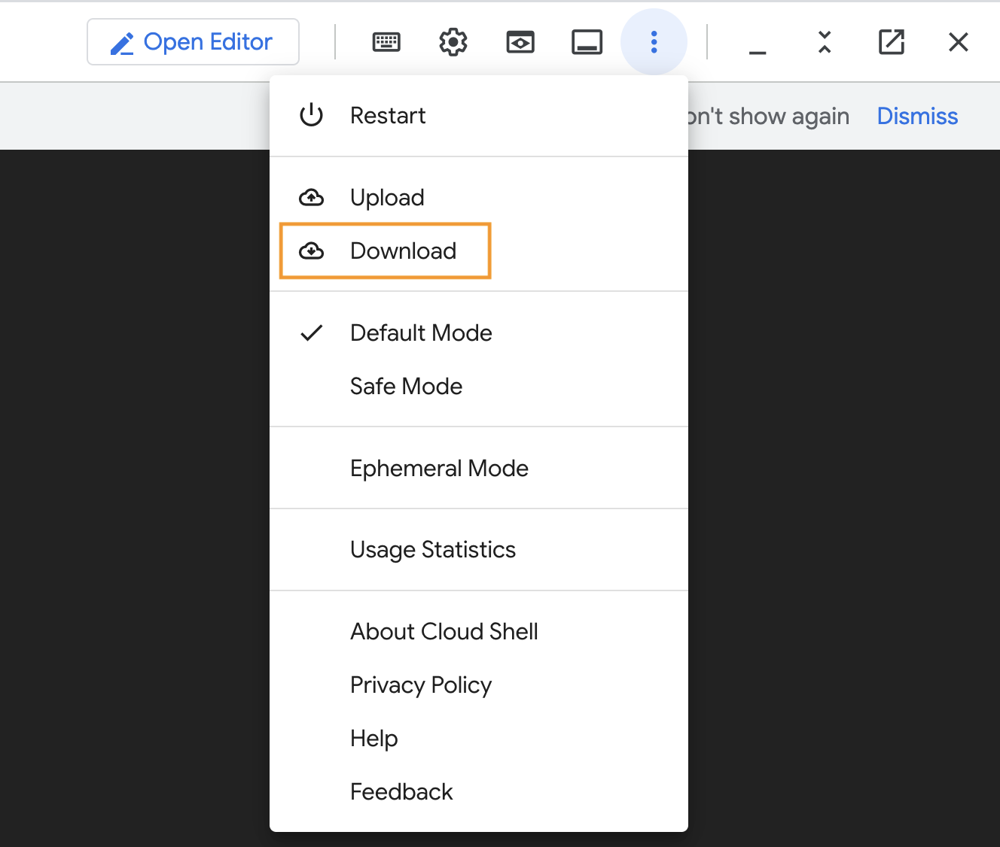

# Resource Discovery for GCP

## Overview

The GCP Usage Discovery Tool is a bash script that generates usage reports from your Google Cloud Platform environment. This script extracts detailed list price and usage data from BigQuery billing exports for migration planning and pricing analysis.

```
┌─────────────────────────────────────────────────────────────────────┐
│                        Google Cloud Platform                        │
│                                                                     │
│   ┌──────────────┐         ┌──────────────┐         ┌────────────┐  │
│   │ Cloud Shell  │         │   BigQuery   │         │   Cloud    │  │
│   │              │         │              │         │  Storage   │  │
│   │ 1. Clone     │  2a.    │ ┌──────────┐ │  2b.    │            │  │
│   │    repo      │──-Run──▶│ │ Billing  │ │──Save─-▶│ Usage Data │  │
│   │              │  query  │ │  Table   │ │ results │  CSV.gz    │  │
│   │ 2. Run       │         │ └──────────┘ │         │            │  │
│   │    script    │         └──────────────┘         └────────────┘  │
│   │              │                                         │        │
│   │ 3. Download  │◀────────────────────────────────────────┘        │
│   │    & Package │              download                            │
│   │              │                                                  │
│   │ 4. ZIP file  │                                                  │
│   │    created   │                                                  │
│   └──────────────┘                                                  │
│         │                                                           │
└─────────┼───────────────────────────────────────────────────────────┘
          │
          │ 5. Share results
          ▼
   ┌────────────────┐
   │   AWS Team     │
   │   (Analysis)   │
   └────────────────┘
```

The script pulls one month of usage data from your GCP detailed billing export including service details, resource identifiers, usage, list prices, and list credits. Negotiated pricing, adjustments, rounding errors, and taxes are not included. See [Data Dictionary](docs/DATA_DICTIONARY.md) for the full column reference.

**Note:** When you share the output from resource-discovery-for-gcp with AWS or an AWS partner, it will be processed on AWS infrastructure. The AWS Region used for processing depends on the service used for analysis.

---

## Table of Contents
- [Prerequisites](#prerequisites)
- [Running the Script](#running-the-script)
- [Usage Details](#usage-details)
- [Troubleshooting](#troubleshooting)
- [Contributing](#contributing)
- [License](#license)
- [Security](#security)


---

## Prerequisites

**1. Detailed Billing Export with Prior Month's Data**

**You MUST have detailed billing export enabled with complete data for the prior month.**

| Your Status | What To Do |
|-------------|------------|
| **Already Enabled** | Verify you have complete data for the prior month, then proceed |
| **Not Enabled** | **Do not run this script.** Contact your AWS representative for alternative options |
| **Not Sure** | Check your BigQuery detailed billing export for prior month's data |

**How to enable (if not already enabled):** Follow the official GCP documentation:
- [Export Cloud Billing data to BigQuery](https://cloud.google.com/billing/docs/how-to/export-data-bigquery-setup)
- [Detailed usage cost data](https://cloud.google.com/billing/docs/how-to/export-data-bigquery-tables/detailed-usage)

Enable **"Detailed usage cost data"** export. If you're enabling this for the first time now, contact your AWS representative. Do not run this script. Your AWS representative will provide alternative data collection options.

**2. Cloud Storage Bucket Access**

- Access to a Cloud Storage bucket for output files

**3. Required Permissions**

Grant the minimum required permissions for users to run the extraction script:

| Service | Recommended Predefined Role | Permission | Purpose | Scope | Resource Access |
|---------|----------------------------|-----------|---------|-------|-----------------|
| **BigQuery (Data)** | BigQuery Data Viewer | `bigquery.tables.get` | View table metadata | Dataset level | Billing export dataset |
| | | `bigquery.tables.getData` | Read billing table | Dataset level | Billing export dataset |
| | | `bigquery.tables.export` | Export data from tables | Dataset level | Billing export dataset |
| **BigQuery (Execution)** | BigQuery Job User | `bigquery.jobs.create` | Execute queries and export jobs | Project level | Billing project |
| **Cloud Storage** | Storage Object User | `storage.buckets.get` | Verify bucket exists | Bucket level | Output bucket |
| | | `storage.objects.create` | Write export files | Bucket level | Output bucket |
| | | `storage.objects.get` | Read objects (for verification) | Bucket level | Output bucket |
| | | `storage.objects.list` | List objects in bucket | Bucket level | Output bucket |

**4. Cloud Shell Access** 

This script is designed to run in Cloud Shell.

**Performance Tip:** Cloud Shell runs within Google's network, providing fast access to BigQuery and Cloud Storage. For best performance, ensure your BigQuery dataset and Cloud Storage bucket are in the same region when possible.

**5. When to Run This Script**

**Run the script on or after the 5th day of the month for complete data.**

| Run Date | Data Extracted | Why Wait? |
|----------|----------------|-----------|
| April 5+ | March (full month) | Captures late-arriving usage data from March |
| April 1-4 | March (may be incomplete) | Some March usage data may still be arriving |

**Example:** If today is April 8, 2025, the script extracts all March 2025 usage data.

---

## Running the Script

**Best Practice:** Run this script on or after the **5th day of the month** to capture complete usage data from the prior month. See [Prerequisites](#prerequisites) for details.

**1. Open Cloud Shell**

Open Cloud Shell in your GCP Console and clone the repository:

```bash
git clone https://github.com/awslabs/resource-discovery-for-gcp.git
cd resource-discovery-for-gcp
```

**2. Configure**

Copy the example config file and update with your values:

```bash
cp config.example.env config.env
```

Edit `config.env` with your billing table, bucket, and customer name. See `config.example.env` for all available options.

**3. Run the Script**

```bash
./scripts/gcp_usage_discovery.sh -f config.env
```

**Optional: Dry-run mode** - Validate configuration and see query without executing:

```bash
./scripts/gcp_usage_discovery.sh -f config.env --dry-run
```

This displays the query, validates it with BigQuery, without actually extracting any data. Useful for verifying configuration before running the full extraction.



The script validates your inputs, checks permissions, validates the query, shows the amount of data to be processed, and begins the BigQuery export. You'll be prompted to confirm at three points: after reviewing parameters, if data availability warnings occur, and before query execution (unless `-y` flag is used). The full execution typically takes a few minutes depending on data volume.



**4. Share/upload results**

The script packages results into a ZIP file:

| File Type | Naming Pattern | Example |
|-----------|---------------|---------|
| **Results ZIP (success)** | `gcp_usage_<customer>_<timestamp>_<format>_<period>.zip` | |
| **Log (failure)** | `logs/gcp_usage_<customer>_<timestamp>_<format>_<mode>.log` | |

**On successful runs:** Download the ZIP file from Cloud Shell. Share with your AWS representative or upload to analysis tool.

To download from Cloud Shell, click the three-dot menu (More) in the Cloud Shell terminal header and select **Download**. Choose the ZIP file shown in the script output.



**On failed runs:** Share the log file from the `logs/` folder with your AWS representative for troubleshooting.
**Note:** Original files remain in Cloud Storage as backup.

---

## Usage Details

### Parameters

**Configuration Priority:** CLI parameters always override config file values. Use CLI flags to override specific settings without editing the config file (e.g., `-t ""` to clear tags, `-p ""` to remove project filter).

| Parameter | Required | Description | Default | Example |
|-----------|----------|-------------|---------|---------|
| `-f` | No | Config file path (recommended) | None | `config.env` |
| `-b` | Yes* | BigQuery billing table (project.dataset.table) | None | `myproject.billing.gcp_export` |
| `-s` | Yes* | Cloud Storage bucket (without gs:// prefix) | None | `mybucket` or `mybucket/folder` |
| `-c` | Yes* | Output file prefix (e.g., customer/workload name)** | None | `acme` |
| `-m` | No | Month (YYYYMM format) | Prior month | `202512` |
| `-t` | No | Tags to capture (comma-separated) | None | `environment,env` |
| `-l` | No | Labels to capture (comma-separated) | None | `cost-center,team` |
| `-p` | No | Project IDs to filter (comma-separated) | All projects | `proj1,proj2` |
| `-y` | No | Skip confirmation prompts | Interactive | N/A |
| `--dry-run` | No | Validate query without executing | Execute query | N/A |
| `--anonymize` | No | Hash sensitive identifiers in output (see [Anonymization](#anonymization)) | Disabled | N/A |
| `-h` | No | Show help | N/A | N/A |

**Advanced Parameters:**

These parameters are functional but not supported by all downstream analysis tools. Use under guidance from your AWS representative.

| Parameter | Description | Limitation |
|-----------|-------------|------------|
| `-r <days>` | Extract N days ending yesterday instead of a full month. Use when billing export was recently enabled and a full month of data is not yet available. | Max 31 days. Mutually exclusive with `-m`. |
| `--use-standard-export` | Use standard billing export (no resource-level details) | Output lacks resource identification columns. |

> **\* Required** unless provided via config file (`-f`) or entered interactively when prompted.
>
> **\*\* Note:** The `-c` parameter is used **only for naming output files**. It does NOT filter the usage data. All usage data for the specified period will be extracted regardless of this value. To filter by project, use the `-p` parameter.

### Anonymization

⚠️ When anonymized, you will not be able to link results back to specific resources in your GCP environment. Use this option only when identifier protection is required.

When `--anonymize` is used, the following identifiers are hashed in the CSV output using SHA-512 with a random salt:

| Field | Anonymized | Example output |
|-------|-----------|----------------|
| resourceName | Yes | `res_a3f5c8d9e2b14f6a7890` |
| resourceGlobalName | Yes | `global_a3f5c8d9e2b14f6a7890` |
| projectID | Yes | `proj_a3f5c8d9e2b14f6a7890` |
| All other columns | No | Original values |

When `--anonymize` is used, configuration values (billing table name, bucket name, project filter) are also redacted from the log file and execution metadata.

**Salt file:** A file named `anonymize.salt` is generated on the first `--anonymize` run and reused on subsequent runs to ensure consistent hashes. The salt file is security-sensitive: anyone who obtains both the salt and the anonymized output can recover resource and project identifiers by hashing known values against the salt. Do not share the salt file.

See [Data Dictionary](docs/DATA_DICTIONARY.md) for full column details.

---

## Troubleshooting

See [Troubleshooting Guide](docs/TROUBLESHOOTING.md) for common errors and solutions.

---

## Contributing

We welcome bug reports and feature requests! See [CONTRIBUTING.md](CONTRIBUTING.md) for details.

---

## Security

See [CONTRIBUTING](CONTRIBUTING.md#security-issue-notifications) for more information.

---

## License

This library is licensed under the MIT-0 License. See the LICENSE file.

